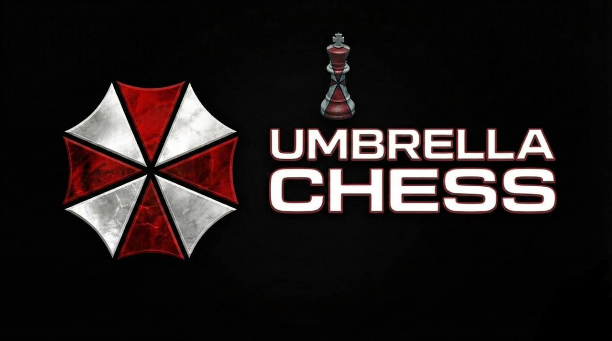

# UmbrellaChess



## О проекте

**UmbrellaChess** — это гибконастраиваемый и скрытный шахматный бот, разработанный на основе нейросети **Maia 2**. Программа эмулирует человеческий стиль игры, что позволяет избегать обнаружения анти-чит системами.

## Происхождение названия

Название и визуальная стилистика проекта являются ироничной отсылкой к известному программному обеспечению **Umbrella** для Dota 2. Интерфейс повторяет узнаваемый дизайн, обыгрывая концепцию полного контроля над ситуацией в контексте шахматной партии.

## Ключевые особенности

- **Скрытность (Stealth)**: Использование Maia 2 обеспечивает ходы, максимально приближенные к человеческим, в отличие от стандартных движков (Stockfish).
- **Гибкая настройка**: Возможность детальной конфигурации стиля и силы игры.
- **Безопасность**: Минимизация рисков бана благодаря естественному поведению бота.
- **Совместимость**: Работает исключительно на платформе chess.com.


## Установка и запуск

1. Установите необходимые библиотеки:
   ```bash
   pip install -r requirements.txt
   ```
2. Запустите графический интерфейс:
   ```bash
   python src/gui.py
   ```
